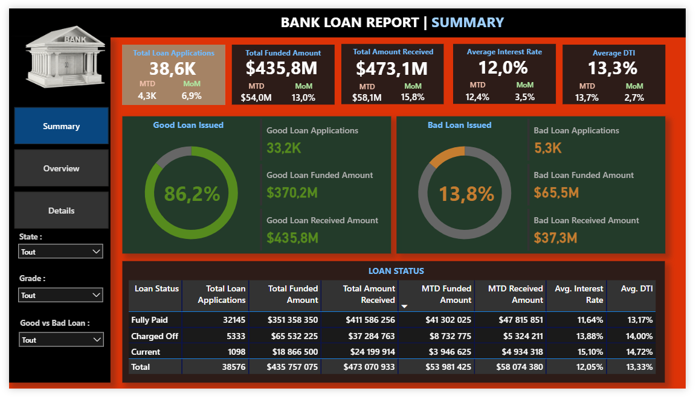
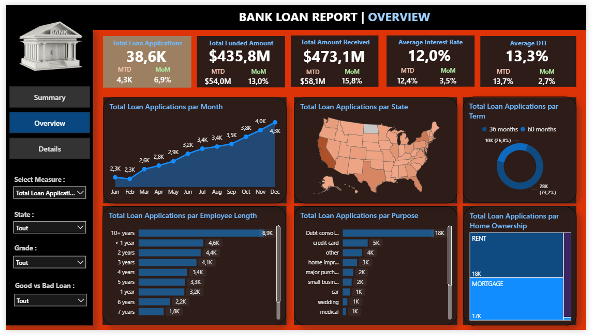
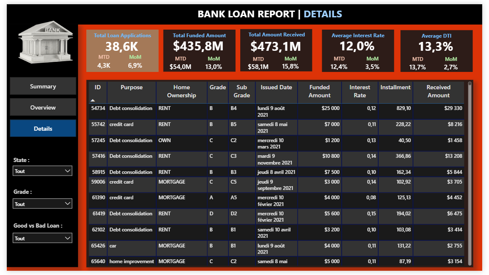

# Bank Loan Analysis Dashboard
## Overview
A comprehensive Power BI dashboard for analyzing bank loan performance, risk assessment, and portfolio management. This project provides actionable insights into loan applications, funding patterns, repayments, and borrower demographics.

## key Features
Real-time KPI tracking (Applications, Funded Amount, Interest Rates)

Loan Status Analysis (Good vs Bad loans)

Interactive filters for drill-down analysis

Monthly trend analysis (MTD, PMTD comparisons)

Risk assessment with DTI (Debt-to-Income) metrics

Multi-dimensional analysis (State, Purpose, Term, Home Ownership)

## Dashboard Sections
1. Summary Dashboard
   

High-level overview of key loan performance metrics including total applications, funded amounts, and portfolio health indicators.

2. Overview Dashboard

Detailed analysis across multiple dimensions including monthly trends, loan purposes, and borrower demographics.

3. Details Dashboard

Transaction-level view showing individual loan records, interest rates, and repayment status.
 Insights & Findings
 Positive Indicators
Strong Portfolio Health: 86.2% good loan rate indicates effective credit management

Revenue Growth: 15.8% MoM increase in received amounts

Managed Risk: Average DTI of 13.3% suggests reasonable borrower debt levels

### Areas for Attention
Bad Loan Volume: 13.8% charged-off loans requiring review

Interest Rate Variance: Current loans show highest interest rates (15.10%)

### Monthly Trends
Peak Application Month: December (5.1K applications)

Steady Growth: 94% increase from January to December

Seasonal Pattern: Higher activity in Q4 months

### Technical Implementation
Data Pipeline
#### Data Source: MySQL database with comprehensive loan records

#### SQL Processing: Custom queries for KPI calculation and aggregation

#### Data Transformation: Power Query for cleaning and preparation

#### Visualization: Power BI for interactive dashboard creation
#### Dashboard Components
### Data Model: Star schema with fact and dimension tables

### Measures: 30+ DAX calculations for dynamic metrics

### Visuals: 15+ interactive charts and tables

